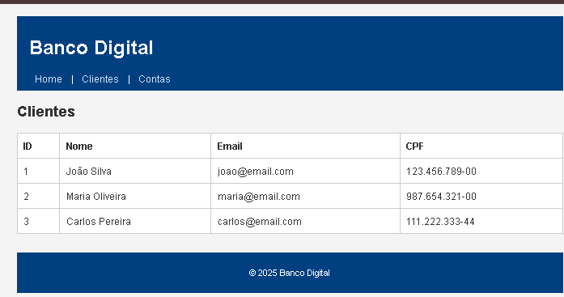
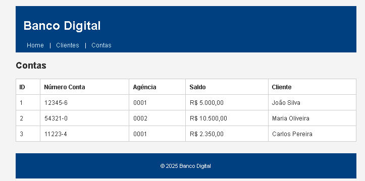

# Banco Digital Simples - API com Frontend Estático

Projeto exemplo de um banco digital simples usando Java 17, Spring Boot 3, JPA e banco H2 em memória. Inclui um site estático servido pelo Spring Boot dentro da pasta `resources/static`.

---

# Meu Projeto/artigo


---
## Tecnologias

- Java 17
- Spring Boot 3 (versão 3.1.4)
- Spring Data JPA
- Banco de dados H2 (in-memory)
- Thymeleaf (caso queira usar templates dinâmicos no futuro)
- Gradle como gerenciador de dependências
- Swagger UI para documentação da API
- HTML, CSS para frontend estático

---

http://localhost:8080/index.html

http://localhost:8080/clientes.html

http://localhost:8080/contas.html

http://localhost:8080/conta-detalhe.html


---

## Estrutura do projeto

- `src/main/java` - código fonte Java (entidades, controllers, services, repositories)
- `src/main/resources/static` - arquivos estáticos (HTML, CSS, JS)
- `src/main/resources/application.yml` - configurações do Spring Boot e banco de dados
- `docs/images` - imagens usadas no README

---

## Configuração do banco

- Banco H2 configurado em memória
- Console H2 disponível em: [http://localhost:8080/h2-console](http://localhost:8080/h2-console)
- JDBC URL: `jdbc:h2:mem:banco`
- Usuário: `sa`
- Senha: (vazia)

---

## Screenshots

### Página Inicial


### Lista de Clientes


### Histórico de Transações


### BANCO H2


### BANCO H2 INFO


---

## Como rodar

Pré-requisitos:

- Java 17 instalado
- Gradle (wrapper incluso no projeto)

Comandos para rodar a aplicação:

```bash
./gradlew bootRun
